<div align="center">
  <h1><code>Wake PC Box</code></h1>
  <p>
    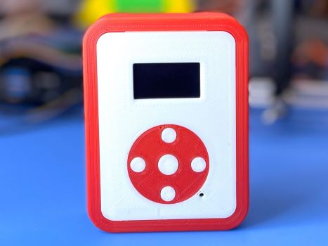
  </p>
</div>

# Wake PC Box - Wake On LAN Packet Transmitting Box

Video
[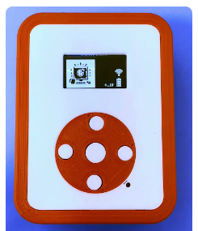](https://www.youtube.com/watch?v=YX_4e1eiLbk)

This is the small control box that can wake up the PC using Wake On LAN. You can just push a button, PCs will wake up from the power off status.
There is no need to start up another PC in order to start up a PC with Wake On Lan. Wake on LAN packets are sent via WiFi LAN.
The Box has a battery, and you can charge it from a USB Type-C port. Once charging full, you can use it for a month. If any buttons are not pressed for the specified time (default 30 seconds), the box will sleep automatically and conserve battery power. Up to four PCs can be registered.

# Update History
- 2024-05-30 : Initial Release
- 2026-02-14 : Update code for ESP-IDF V5.4.2 and update README.md

# How it works

This box can send a Wake on LAN packet to the Wireless Access Point. To transfer the packet, the Access Point needs to be set to `Bridge Mode`. If `Router Mode` is set, the Access Point won't transfer to the wired LAN. 

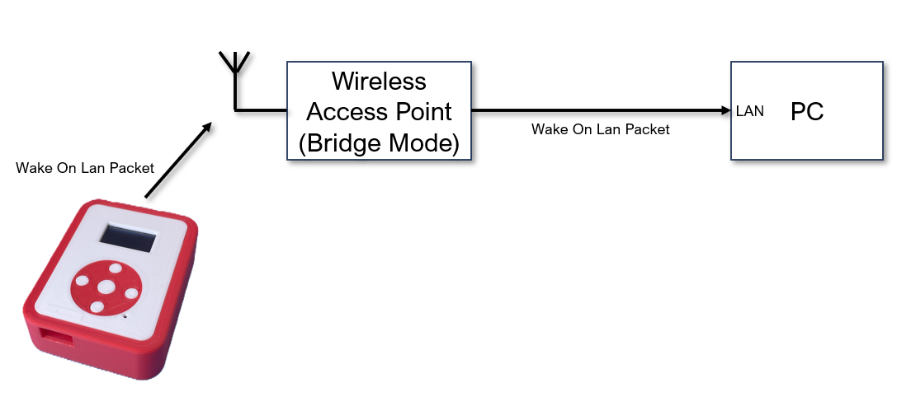

# Feature

**Quick Wake Up** -  Simply press one of the up, down, left, or right buttons to turn on the PC corresponding to that button. 4 PCs can be registered.

**Microcontroller on board** - No need for a PC when you turn on another PC. Directly send packets to the target PCs. 

**Transmit a packet via WiFi** - Wake-on LAN packets are transmitted via Wireless Network.

**Battery Powered** - Using LiPo battery. It can run for a month (In this case, every day a few times used).

**Small Handy Box** - This box is only 60mm(W) x 23mm(H) x 80mm(D) size. No need for any cables, it works. 

**Configurable** - Setting parameters are set from the display menu. SSID/Password/Target PC Hardware Address(4 PCs)/Time Zone/Sleep Time/Sleep Mode/Display Off Time/Reset Settings.

# How to Use the Box
At first, you can set the WiFi SSID and PSK-Password. To set them, push the Center Key, you can see the setting menu, then select the `WiFi` using the UP or Down Key, and click the Center Key. Then, select `SSID` and enter your SSID of the Wireless Access point using the Up/Down/Left/Right key. After entering the SSID, push the center key, select `yes` using the Right key, then, push the Center key. Similarly, set the PSK-Password.
Next, set the Hardware Address(Ethernet MAC Address) of the PC that you want to wake up. Select `HW Address` and push Center Key, select from `PC1` to `PC4`, push Center key, then enter your Hardware Address like `00:11:22:33:44:55`. 

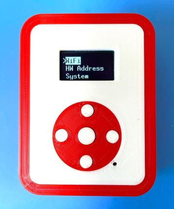   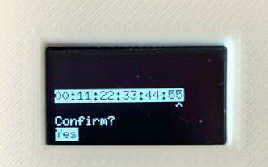

After setting, just push button corresponding the target.(Up Key : PC1, Down Key : PC2, Left Key: PC3, Right Key: PC4)

To charge a battery, just connect to a USB Type-C port from the bus-powered USB port. During the charge, the CHG LED is RED ON. After the charging is full, the FUL LED is GREEN ON. And the charging will be stopped automatically.

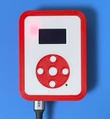  

Assembled PCB

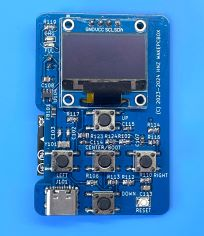   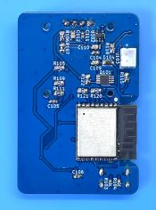 

Set in Box

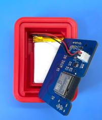   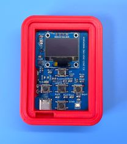

# How to build from code and Install to the unit.

Using Ubuntu 22.04.3 LTS and ESP-IDF V5.4.2

1. Install Rust Compiler
```bash
sudo apt update && sudo apt -y install git python3 python3-pip gcc build-essential curl pkg-config libudev-dev libtinfo5 clang libclang-dev llvm-dev udev libssl-dev python3.10-venv
curl --proto '=https' --tlsv1.2 -sSf https://sh.rustup.rs | sh
```
You can see the install menu, select No.1. After installation, set the environment variable.

```bash
. "$HOME/.cargo/env"
```

2. Install toolchain for ESP32-C3
```bash
cargo install ldproxy
cargo install espup
cargo install cargo-espflash
```

3. Install ESP-IDF and set the environment variable.
```bash
espup install
espup update
```

Then, run the following command to set the environment for the ESP32-C3 toolchain:
```bash
. ./export-esp.sh
```

4. Add UDEV rules
```bash
sudo sh -c 'echo "SUBSYSTEMS==\"usb\", ATTRS{idVendor}==\"303a\", ATTRS{idProduct}==\"1001\", MODE=\"0666\"" > /etc/udev/rules.d/99-esp32.rules'
sudo udevadm control --reload-rules
sudo udevadm trigger
```

5. Download Current-Logger code
```bash
git clone https://github.com/hnz1102/wakepcbox.git
cd wakepcbox
``` 
6. Setting WiFi SSID, Password, and InfluxDB server IP address.
```bash
cfg.toml

[wakepcbox]
wifi_ssid = "<SSID>"      # Set your AP SSID.
wifi_psk = "<Password>"   # Set password for SSID.
target_mac_address1 = "00:00:00:00:00:00"  # Set Hardware Address(MAC Address) for wakeup.
target_mac_address2 = "00:00:00:00:00:00"
target_mac_address3 = "00:00:00:00:00:00"
target_mac_address4 = "00:00:00:00:00:00"
timezone_offset = "0"
idle_in_sleep_time = "30"
sleep_mode = "light"
display_off_time = "30"
wakeup_interval = "10"
```
7. Build code and writing flash
```bashbash
cargo build --release
```

8. Connecting the board and Set device and set toolchain.

Connecting the Box by USB Type-C to this code building PC. Then, 

```bash
cargo espflash board-info

✔ Use serial port '/dev/ttyACM0' - USB JTAG/serial debug unit? · yes
✔ Remember this serial port for future use? · yes
[2026-02-14T04:41:35Z INFO ] Serial port: '/dev/ttyACM0'
[2026-02-14T04:41:35Z INFO ] Connecting...
[2026-02-14T04:41:36Z INFO ] Using flash stub
Chip type:         esp32c3 (revision v0.4)
Crystal frequency: 40 MHz
Flash size:        4MB
Features:          WiFi, BLE
MAC address:       a0:76:4e:b3:64:c0

Security Information:
=====================
Flags: 0x00000000 (0)
Key Purposes: [0, 0, 0, 0, 0, 0, 12]
Chip ID: 5
API Version: 3
Secure Boot: Disabled
Flash Encryption: Disabled
SPI Boot Crypt Count (SPI_BOOT_CRYPT_CNT): 0x0
```

9. Writing flash
```bash
cargo espflash flash --release --monitor

[2026-02-14T04:43:53Z INFO ] Serial port: '/dev/ttyACM0'
[2026-02-14T04:43:53Z INFO ] Connecting...
[2026-02-14T04:43:53Z INFO ] Using flash stub
   Compiling wakepcbox v0.1.0 (/wakepcbox)
    Finished `release` profile [optimized] target(s) in 4.22s
Chip type:         esp32c3 (revision v0.4)
Crystal frequency: 40 MHz
Flash size:        4MB
Features:          WiFi, BLE
MAC address:       a0:76:4e:b3:64:c0
App/part. size:    1,644,080/3,145,728 bytes, 52.26%
[00:00:00] [========================================]      13/13      0x0      Verifying... OK!                                                                                                                                                       [00:00:00] [========================================]       1/1       0x8000   Skipped! (checksum matches)                                                                                                                                            
[00:00:15] [========================================]     887/887     0x10000  Verifying... OK!                                                                                                                                                       [2026-02-14T04:44:16Z INFO ] Flashing has completed!

And automatically boot!
```
## Schematic, PCB Gabar and Container 3D Data

There is a Schematic data in the hardware directory including 3D printing data. 

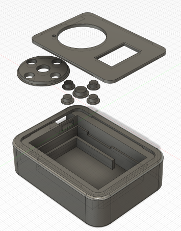 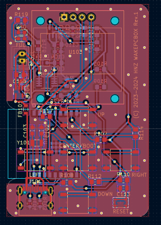

## LICENSE
This source code is licensed under MIT. Other Hardware Schematic documents are licensed under CC-BY-SA V4.0.
