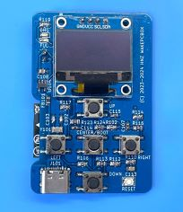
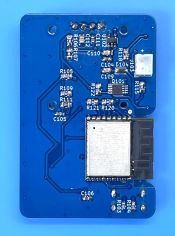

<div align="center">
  <h1><code>Wake PC Box</code></h1>
  <p>
    
  </p>
</div>

# Wake PC Box - Wake On LAN Packet Transmitting Box

Video
[](https://www.youtube.com/watch?v=YX_4e1eiLbk)

This is the small control box that can wake up the PC using Wake On LAN. You can just push a button, PCs will wake up from the power off status.
There is no need to start up another PC in order to start up a PC with Wake On Lan. Wake on LAN packets are sent via WiFi LAN.
The Box has a battery, and you can charge it from a USB Type-C port. Once charging full, you can use it for a month. If any buttons are not pressed for the specified time (default 30 seconds), the box will sleep automatically and conserve battery power. Up to four PCs can be registered.

# How it works

This box can send a Wake on LAN packet to the Wireless Access Point. To transfer the packet, the Access Point needs to be set to `Bridge Mode`. If `Router Mode` is set, the Access Point won't transfer to the wired LAN. 


# Feature

**Quick Wake Up** -  Simply press one of the up, down, left, or right buttons to turn on the PC corresponding to that button. 4 PCs can be registered.

**Microcontroller on board** - No need for a PC when you turn on another PC. Directly send packets to the target PCs. 

**Transmit a packet via WiFi** - Wake-on LAN packets are transmitted via Wireless Network.

**Battery Powered** - Using LiPo battery. It can run for a month (In this case, every day a few times used).

**Small Handy Box** - This box is only 60mm(W) x 23mm(H) x 80mm(D) size. No need for any cables, it works. 

**Configurable** - Setting parameters are set from the display menu. SSID/Password/Target PC Hardware Address(4 PCs)/Time Zone/Sleep Time/Sleep Mode/Display Off Time/Reset Settings.

# How to Use the Box
At first, you can set the WiFi SSID and PSK-Password. To set them, push the Center Key, you can see the setting menu, then select the `WiFi` using the UP or Down Key, and click the Center Key. Then, select `SSID` and enter your SSID of the Wireless Access point using the Up/Down/Left/Right key. After entering the SSID, push the center key, select `yes` using the Right key, then, push the Center key. Similarly, set the PSK-Password.
Next, set the Hardware Address(Ethernet MAC Address) of the PC that you want to wake up. Select `HW Address` and push Center Key, select from `PC1` to `PC4`, push Center key, then enter your Hardware Address like `00:11:22:33:44:55`. 

   

After setting, just push button corresponding the target.(Up Key : PC1, Down Key : PC2, Left Key: PC3, Right Key: PC4)

To charge a battery, just connect to a USB Type-C port from the bus-powered USB port. During the charge, the CHG LED is RED ON. After the charging is full, the FUL LED is GREEN ON. And the charging will be stopped automatically.

  

Assembled PCB

    

Set in Box

   

# How to build from code and Install to the unit.

Using Ubuntu 22.04.3 LTS and ESP-IDF V5.1.2

1. Install Rust Compiler
```bash
$ sudo apt update && sudo apt -y install git python3 python3-pip gcc build-essential curl pkg-config libud  ev-dev libtinfo5 clang libclang-dev llvm-dev udev
$ curl --proto '=https' --tlsv1.2 -sSf https://sh.rustup.rs | sh
select No.1
$ source "$HOME/.cargo/env"
```

2. Install ESP-IDF (If use esp-idf v5.1.2, need to install and set export values)
```bash
$ sudo apt -y install git wget flex bison gperf python3 python3-venv cmake ninja-build ccache libffi-dev libssl-dev dfu-util libusb-1.0-0
$ sudo apt install python3.10-venv
$ git clone -b v5.1.2 --recursive https://github.com/espressif/esp-idf.git esp-idf-v5.1.2
$ cd esp-idf-v5.1.2/
$ ./install.sh esp32c3
$ . ./export.sh
$ cd ..
```
3. Install toolchain for ESP32-C3
```bash
$ cargo install ldproxy
$ cargo install espup
$ rustup toolchain install nightly --component rust-src
$ rustup target add riscv32imc-unknown-none-elf
$ cargo install cargo-espflash
```

4. Add UDEV rules
```bash
$ sudo sh -c 'echo "SUBSYSTEMS==\"usb\", ATTRS{idVendor}==\"303a\", ATTRS{idProduct}==\"1001\", MODE=\"0666\"" > /etc/udev/rules.d/99-esp32.rules'
$ sudo udevadm control --reload-rules
$ sudo udevadm trigger
```

5. Download Current-Logger code
```bash
$ git clone https://github.com/hnz1102/wakepcbox.git
$ cd wakepcbox
``` 
6. Setting WiFi SSID, Password, and InfluxDB server IP address.
```bash
cfg.toml

[wakepcbox]
wifi_ssid = "<SSID>"      # Set your AP SSID.
wifi_psk = "<Password>"   # Set password for SSID.
target_mac_address1 = "00:00:00:00:00:00"  # Set Hardware Address(MAC Address) for wakeup.
target_mac_address2 = "00:00:00:00:00:00"
target_mac_address3 = "00:00:00:00:00:00"
target_mac_address4 = "00:00:00:00:00:00"
timezone_offset = "0"
idle_in_sleep_time = "30"
sleep_mode = "light"
display_off_time = "30"
wakeup_interval = "10"
```

7. Connecting the board and Set device and set toolchain.
```bash
Connecting the Box by USB Type-C to this code building PC. Then, 
$ cargo espflash board-info
select /dev/ttyACM0
Chip type:         esp32c3 (revision v0.4)
Crystal frequency: 40MHz
Flash size:        4MB
Features:          WiFi, BLE
MAC address:       xx:xx:xx:xx:xx:xx

If the board is not recognized from PC, press Reset SW and Center button.

$ rustup component add rust-src --toolchain nightly-2023-12-28-x86_64-unknown-linux-gnu 
```

8. Build code and writing flash
```bash
$ cargo espflash flash --release --monitor
Chip type:         esp32c3 (revision v0.4)
Crystal frequency: 40MHz
Flash size:        4MB
Features:          WiFi, BLE
MAC address:       xx:xx:xx:xx:xx:xx
Bootloader:        /wakepcbox/target/riscv32imc-esp-espidf/release/build/esp-idf-sys-062fa44bc96bf539/out/build/bootloader/bootloader.bin
Partition table:   /wakepcbox/partitions.csv
App/part. size:    1,624,544/3,145,728 bytes, 51.64%
[00:00:00] [========================================]      13/13      0x0                                                                                                                       
[00:00:00] [========================================]       1/1       0x8000                                                                                                                    
[00:00:18] [========================================]     879/879     0x10000                                                                                                                   [2024-01-28T05:33:53Z INFO ] Flashing has completed!

And automatically boot!
```
## Schematic, PCB Gabar and Container 3D Data

There is a Schematic data in the hardware directory including 3D printing data. 

 

## LICENSE
This source code is licensed under MIT. Other Hardware Schematic documents are licensed under CC-BY-SA V4.0.
